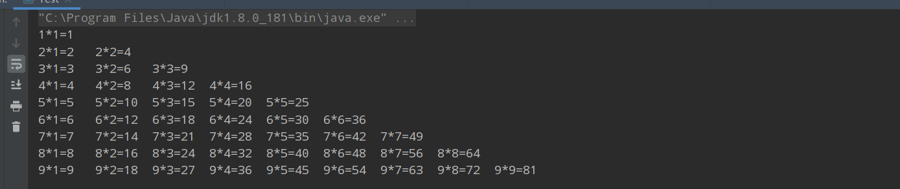
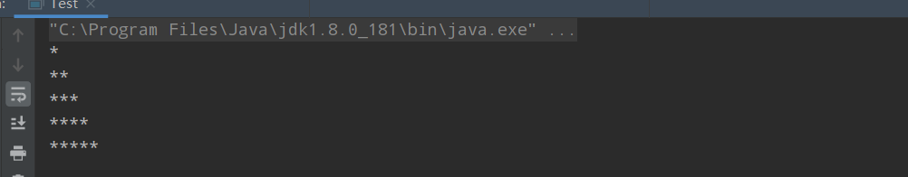
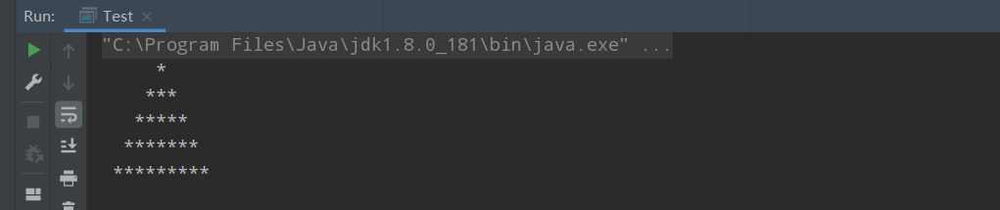
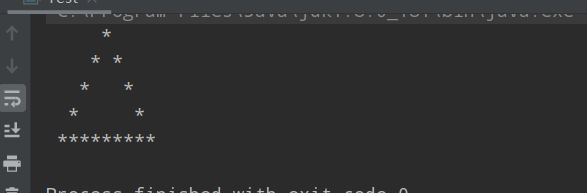

## java基础

### 1. java循环练习题

#### 1.分支循环

> 做题之前 认真分析题意
>
> 编程思想：
>
> 先繁后简 先死后活  

##### 1.for循环那些事

###### 1. continue break 和return在for循环中的作用

```java
// continue跳过本次循环   i:5 i:10  测试
// break 终止循环(跳出循环体)  测试
// return 跳出整个方法  什么都不输出
public void test() {
for (int i = 1; i <= 10; i++) {
    if (i%5!=0) {
        return;
    }
    System.out.println("i:"+i);
}
System.out.println("测试");
}
```

###### 2.迭代for循环 建议使用forEach

```java
 public  void test() {
     List<String> list= Arrays.asList("a","b");
     list.forEach(value->{
         // value得到list中的每个值
     });
     list.forEach(System.out::println); // 直接打印到控制台
 }
```

#### 2. while

###### while 练习题

```java
 @Test
    public void test01() {
// 1.打印1-100之间能被3整除的数(使用while)
//        int start=1;
//        int end=100;
//        while (start<=end) {
//            if (start%3==0) {
//                System.out.println("被3整除的数:"+start);
//            }
//
//            start++;
//        }
        // 2.打印40-200之间的偶数
        int start=40;
        int end=200;
        while (start<=end) {
            if (start%2==0) {
                System.out.println("偶数:"+start);
            }
            start++;
        }

    }
```

#### 3. dowhile

###### dowhile练习题

```java
  // 1. 统计1-200之间能被5整除但不能被3整除的个数
    int start = 1;
    int count=0;
    do {
        if (start % 5 == 0 && start % 3 != 0) {
            count++;
        }
        start++;
    } while (start <= 200);
    System.out.println(count);
2.   // 如果李三不还钱，则老韩将一致使出5连鞭，直到李三说还钱为止
        Scanner scanner = new Scanner(System.in);
        char answer = ' ';
        do {
            System.out.println("老韩问:还钱吗?y/n");
            answer = scanner.next().charAt(0);
            System.out.println("他的回答是:" + answer);
        } while (answer != 'y');
```

#### 4.双重循环😀重点

###### 1.统计3个班成绩情况

```java
  
// 统计3个班成绩情况，每个班有5名同学，求出每个班的平均分和所有班级的平均分[学生成绩从键盘键入]
// 统计三个班级的几个人数
int passNum = 0;
int totalScore = 0;
Scanner scanner = new Scanner(System.in);
for (int i = 1; i <= 3; i++) {
    int sum1 = 0;
    for (int j = 1; j <= 5; j++) {
        System.out.println("请输入第" + i + "个班第" + j + "名学生的成绩");
        int score = scanner.nextInt();
        System.out.println("第" + j + "名学生的成绩为" + score);
        sum1 += score;
        if (score >= 60) {
            passNum++;
        }
    }
    totalScore += sum1;
    System.out.println("第一个班级的平均成绩" + sum1 / 5);
}
System.out.println("所有班级的总成绩" + totalScore + "平均成绩为:" + totalScore / (3 * 5));
```

###### 2.打印九九乘法表

```java
// 打印九九乘法表
for (int i = 1; i <= 9; i++) { 
    for (int j = 1; j <= i; j++) {
        System.out.print(i+"*"+j+"="+(i*j)+"\t");
    }
    System.out.println();
}
```



###### 3.金字塔问题

1.打印半个金字塔

```java
int totalLevel = 5;//定义层数
for (int i = 1; i <= totalLevel; i++) { // 表示层数
    // 控制打印每层的*个数
    for (int j = 1; j <= i; j++) {
        System.out.print("*");
    }
    // 每打印完一层就换行
    System.out.println();
}
```



###### 2.打印整个金字塔

```java
// 第一层 1个*   1     4个空格 (总层数-1) 个空格  5-1      (5-i)
// 第二层 3个* 2i-1    3个空格                  5-2
// 第三层 5个*         2个空格                  5-3
// 第四层 7个*         1个空格                  5-4
int totalLevel = 5;//定义层数
for (int i = 1; i <= totalLevel; i++) {
    // 空格数
    for (int j = 0; j <= totalLevel - i; j++) {
        System.out.print(" ");
    }
    for (int j = 1; j <= (2 * i - 1); j++) {
        System.out.print("*");
    }
    System.out.println();
}
```



###### 3. 空心金字塔

```java
int totalLevel = 5;//定义层数
for (int i = 1; i <= totalLevel; i++) {
    // 空格数
    for (int j = 0; j <= totalLevel - i; j++) {
        System.out.print(" ");
    }
    for (int j = 1; j <= 2 * i - 1; j++) {
        //当前行的第一个位置和最后一个位置的*
        // 最后一层全部输出
        if (j == 1 || j == 2 * i - 1 || i==totalLevel) {
            System.out.print("*");
        } else  {
            System.out.print(" ");
        }
    }

    System.out.println();
}
```



#### 4. 作业题

###### 4.1 .输出1-100之间的不能被5整除的数，每5个一行

```java
int state = 0;
for (int i = 1; i <= 100; i++) {
    if (i % 5 != 0) {
        state++;
        System.out.print(i + " ");
        if (state % 5 == 0) {
            System.out.println();
        }
    }

}
```

###### 4.2:输出小写的a-z以及大些的Z-A

```java
// 输出小写的a-z以及大些的Z-A
// char 可以进行加 char ='a' 相当于 char=97;
for (char c1 = 'a'; c1 <= 'z'; c1++) {
    System.out.print(c1+" ");

}
System.out.println();
for (char c1 = 'Z'; c1 >= 'A'; c1--) {
    System.out.print(c1+" ");

}
```

### 2.数组

#### 2.1 数组的创建方式

>动态创建2中加上一种 静态创建
>
>int [] arr = new int [6];
>        int intValue = arr [5]
>        int [] y = new int [] {1,2,3,4,5}
>
>int [] x = {1,2,3,4} 静态创建


## zookeeper学习


