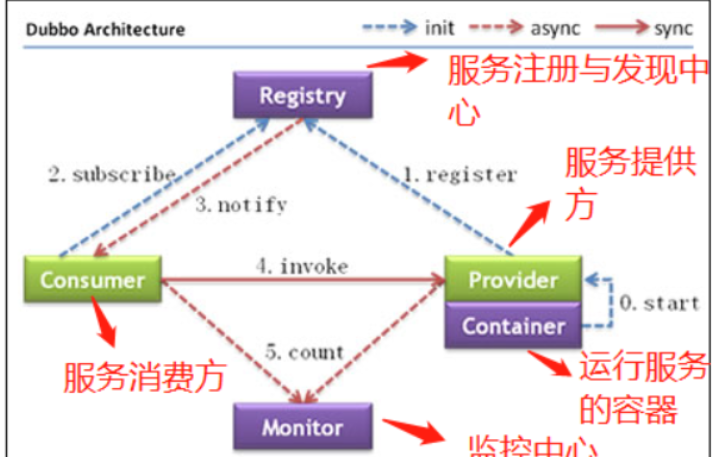
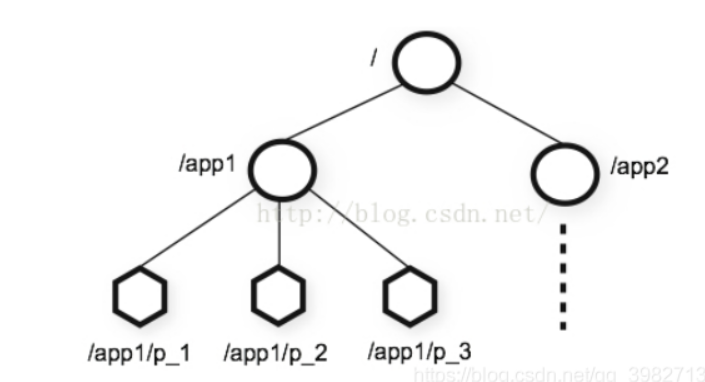
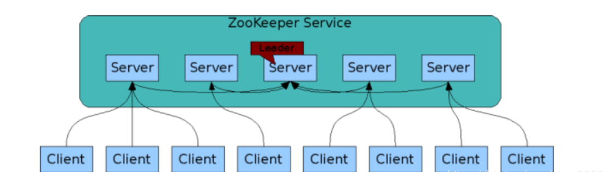
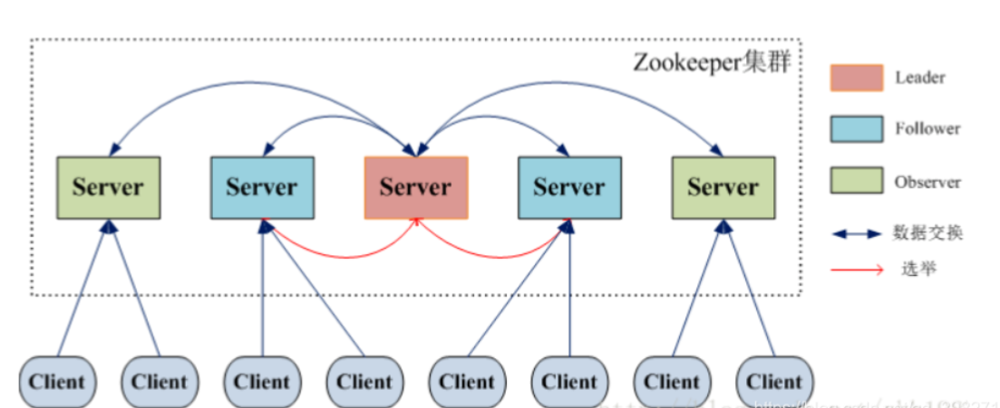
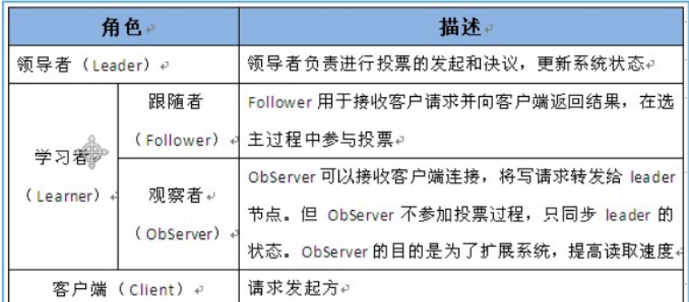

## 1. 什么是Zookeeper

### Zookeeper的由来

> Zookeeper最早起源于雅虎研究院的一个研究小组。在当时，研究人员发现，在雅虎内部很多大型系统基本都需要依赖一个类似的系统来进行分布式协调，但是这些系统往往都存在分布式单点问题。所以，雅虎的开发人员就试图开发一个通用的无单点问题的分布式协调框架，以便让开发人员将精力集中在处理业务逻辑上。
>
> 关于“ZooKeeper”这个项目的名字，其实也有一段趣闻。在立项初期，考虑到之前内部很多项目都是使用动物的名字来命名的（例如著名的Pig项目),雅虎的工程师希望给这个项目也取一个动物的名字。时任研究院的首席科学家RaghuRamakrishnan开玩笑地说：“在这样下去，我们这儿就变成动物园了！”此话一出，大家纷纷表示就叫动物园管理员吧一一一因为各个以动物命名的分布式组件放在一起，雅虎的整个分布式系统看上去就像一个大型的动物园了，而Zookeeper正好要用来进行分布式环境的协调一一于是，Zookeeper的名字也就由此诞生了。
>
> 顾名思义 zookeeper 就是动物园管理员，他是用来管 hadoop（大象）、Hive(蜜蜂)、pig(小
> 猪)的管理员， Apache Hbase 和 Apache Solr 的分布式集群都用到了 zookeeper；Zookeeper:
> 是一个分布式的、开源的程序协调服务，是 hadoop 项目下的一个子项目。他提供的主要功
> 能包括：配置管理、名字服务、分布式锁、集群管理。
>

### Zookeeper概述

>顾名思义 zookeeper 就是动物园管理员，他是用来管 hadoop（大象）、Hive(蜜蜂)、pig(小
>猪)的管理员， Apache Hbase 和 Apache Solr 的分布式集群都用到了 zookeeper；Zookeeper:
>是一个分布式的、开源的程序协调服务，是 hadoop 项目下的一个子项目。他提供的主要功
>能包括：配置管理、名字服务、分布式锁、集群管理。

ZooKeeper 是一个典型的分布式数据一致性解决方案，分布式应用程序可以基于 ZooKeeper 实现诸如数据发布/订阅、负载均衡、命名服务、分布式协调/通知、集群管理、Master 选举、分布式锁和分布式队列等功能。

Zookeeper 一个最常用的使用场景就是用于担任服务生产者和服务消费者的注册中心(提供发布订阅服务)。 服务生产者将自己提供的服务注册到Zookeeper中心，服务的消费者在进行服务调用的时候先到Zookeeper中查找服务，获取到服务生产者的详细信息之后，再去调用服务生产者的内容与数据。

在dubbo中就使用了zookeeper做注册中心这一角色。

## 二：Zookeeper的一些重要概念

> 1. Zookeeper 集群中，节点数只要超过半数存活，Zookeeper就能正常服务。
> 2. 为了保证高可用，最好是以集群形态来部署Zookeeper，这样只要集群中大部分的机器可用，那么Zookeeper本身仍然是可用的。
> 3. ZooKeeper 将数据保存在内存中，这也就保证了 高吞吐量和低延迟（但是内存限制了能够存储的容量不太大，此限制也是保持znode中存储的数据量较小的进一步原因）。
> 4. ZooKeeper 是高性能的。 在“读”多于“写”的应用程序中尤其地高性能，因为“写”会导致所有的服务器间同步状态。（“读”多于“写”是协调服务的典型场景。）
> 5. ZooKeeper有临时节点的概念。 当创建临时节点的客户端会话一直保持活动，瞬时节点就一直存在。而当会话终结时，瞬时节点被删除。持久节点是指一旦这个ZNode被创建了，除非主动进行ZNode的移除操作，否则这个ZNode将一直保存在Zookeeper上。
> 6. ZooKeeper 底层其实只提供了两个功能：①管理（存储、读取）用户程序提交的数据；②为用户程序提供数据节点监听服务。

### Zookeeper的节点类型

> 1. 永久节点
> 2. 永久带序号的节点
> 3. 临时节点
> 4. 临时带序号的节点

### 监听器

> Watcher 就是事件监听器**Zookeeper允许用户注册一些watcher,并且在一些事件特定触发时，ZooKeeper会将通知发给客户端**

### ACI

>Zookeeper采用ACL（AccessControlLists）策略来进行权限控制，类似于 UNIX 文件系统的权限控制。Zookeeper 定义了如下5种权限。
>1. create:创建子节点的权限
>2. read:获取节点数据和子节点列表的权限
>3. write:更新节点的权限
>4. delete:删除节点的权限
>5. admin:设置节点ACL的权限

### 特点

> 1. 顺序一致性： 从同一客户端发起的事务请求，最终将会严格地按照顺序被应用到 ZooKeeper 中去。
> 2. 原子性： 所有事务请求的处理结果在整个集群中所有机器上的应用情况是一致的，也就是说，要么整个集群中所有的机器都成功应用了某一个事务，要么都没有应用。
> 3. **单一系统映像 **： 无论客户端连到哪一个 ZooKeeper 服务器上，其看到的服务端数据模型都是一致的。
> 4. 可靠性： 一旦一次更改请求被应用，更改的结果就会被持久化，直到被下一次更改覆盖。

## 三：ZooKeeper设计特点

### ZooKeeper的数据模型

>数据模型: ZooKeeper 采用的类似文件系统的形式保存数据，文件系统中的每一个节点
>(Znode)都由一个路径唯一标识。在整个数据存储的路径中 / 表示根节点，其他的 Znode
>节点，都是相对于根节点。Znode 可以拥有子节点

### 可搭建集群

## 四：ZooKeeper集群角色介绍

> **在 ZooKeeper 中没有选择传统的 Master/Slave 概念**，而是引入了**Leader、Follower 和 Observer **三种角色。如下图所示:

ZooKeeper 集群中的所有机器通过一个 Leader 选举过程来选定一台称为 “Leader” 的机器，Leader 既可以为客户端提供写服务又能提供读服务。除了 Leader 外，Follower 和 Observer 都只能提供读服务。Follower 和 Observer 唯一的区别在于 Observer 机器不参与 Leader 的选举过程，也不参与写操作的“过半写成功”策略，因此 Observer 机器可以在不影响写性能的情况下提升集群的读性能。

## 五：客户端操作zookeeper

